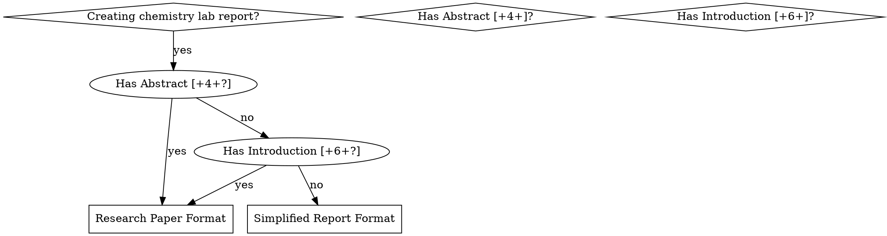

# Initializing Chemistry Lab Reports

## Overview

Generates professional chemistry lab report templates in LaTeX by analyzing lab handouts and automatically selecting the appropriate format (research paper or simplified report) with all required sections.

## When to Use



**Use when:**
- Starting a new organic chemistry lab report
- Lab handout specifies sections with point values
- Handout includes "Answer Q1, Q2..." or numbered questions
- Need chemical structure drawings (chemfig)
- Requires data tables with proper formatting
- Need percent yield or recovery calculations

**Do NOT use when:**
- Lab report already exists
- Not a chemistry/science lab report
- No handout or requirements document available

## Quick Reference

| Handout Feature | Format Type | LaTeX Structure |
|----------------|-------------|-----------------|
| Abstract [+4+], Introduction [+6+] | Research Paper | twocolumn, full ACS-style |
| Purpose [+2], Answer Q1... | Simplified Report | single column, Q&A format |
| Total points ~50 | Research Paper | Abstract → Introduction → Experimental → Results → Discussion → Conclusion → References |
| Total points ~25 | Simplified | Title → Purpose → Data → Calculations → Questions → Structures → Conclusion |

## Format Detection

**Research Paper Indicators** (all of these):
- Abstract with ≥4 points
- Introduction with ≥6 points
- Experimental Details with ≥10 points
- Discussion with ≥18 points
- References required
- Total points around 50

**Simplified Report Indicators** (most of these):
- Purpose [+2]
- "Answer Q1, Q2..." explicit questions
- "Data table with a title"
- Calculations for percent yield
- Chemical structure drawings
- IUPAC nomenclature
- Total points around 25

## Template Generation Workflow

1. **Read the handout** file (usually `handout.md` in the lab directory)
2. **Extract requirements**: sections with point values, numbered questions, chemical compounds
3. **Classify format**: Research Paper vs Simplified Report
4. **Generate LaTeX structure** with appropriate packages and sections
5. **Add placeholders** for student content with instructional comments
6. **Create supporting files**: `references.bib` template

## Essential LaTeX Packages

```latex
% Core chemistry packages
\usepackage[version=4]{mhchem}      % Chemical equations: \ce{C6H5COOH}
\usepackage{siunitx}                 % Units: \SI{1.018}{\gram}
\usepackage{chemfig}                 % Structures: \chemfig{*6(-=-(-C(=[2]O)-[0]OH)=-=)}

% Formatting
\usepackage{booktabs}                % Professional tables: \toprule, \midrule, \bottomrule
\usepackage{geometry}                % Page layout
\usepackage{fancyhdr}                % Headers/footers
\usepackage{titlesec}                % Section formatting

% Citations
\usepackage[backend=biber, style=chem-acs]{biblatex}
\addbibresource{references.bib}
```

## Chemistry-Specific Syntax

**Chemical Equations** (mhchem):
```latex
\ce{C6H5COOH}                              % Benzoic acid
\ce{2H2 + O2 -> 2H2O}                      % Reaction
\ce{CH3COCH3 + 2C6H5CHO ->[NaOH] product}  % With catalyst
```

**Units** (siunitx):
```latex
\SI{1.018}{\gram}              % Mass
\SI{45}{\milli\liter}          % Volume
\SIrange{122}{123}{\celsius}   % Temperature range
\SI{3.4}{\milli\gram\per\milli\liter}  % Concentration
```

**Chemical Structures** (chemfig):
```latex
\chemfig{*6(-=-(-C(=[2]O)-[0]OH)=-=)}  % Benzoic acid (aromatic)
\chemfig{C(=[2]O)-[0]OH}               % Carboxylic acid group
```

**Data Tables** (booktabs):
```latex
\begin{table}[htbp]
  \centering
  \caption{Descriptive title}
  \label{tab:label}
  \begin{tabular}{@{}lr@{}}
    \toprule
    \textbf{Measurement} & \textbf{Value} \\
    \midrule
    Mass of sample & \SI{1.018}{\gram} \\
    \bottomrule
  \end{tabular}
\end{table}
```

## Section Structures

### Research Paper Format (twocolumn)

```latex
\documentclass[10pt, twocolumn, letterpaper]{article}

% Title page with abstract
\twocolumn[
  \begin{@twocolumnfalse}
    % Title, author, institution
    % Abstract (≤200 words)
  \end{@twocolumnfalse}
]

\section{Introduction}        % Background, literature, objectives
\section{Experimental Details} % Materials, apparatus, procedure
\section{Results}              % Data tables, calculations
\section{Discussion}           % Interpretation, error analysis
\section{Conclusion}           % Summary, future work
\section*{References}          % \printbibliography
```

### Simplified Report Format (single column)

```latex
\documentclass[11pt, letterpaper]{article}

\section{Purpose}              % Goal + brief background
\section{Data Tables}          % All measurements in tables
\section{Calculations}         % Percent yield, recovery
\section{Questions}            % \subsection{Question 1}, etc.
\section{Chemical Structures}  % \chemfig drawings
\section{Conclusion}           % Summary + principles + results + skills
```

## Common Mistakes

| Mistake | Fix |
|---------|-----|
| Using `mhchem` v3 syntax with v4 package | Use `\usepackage[version=4]{mhchem}` |
| Forgetting `booktabs` for tables | Add `\usepackage{booktabs}` |
| Not using siunitx for units | Use `\SI{value}{unit}` not "value unit" |
| Wrong column format | Research = twocolumn, Simplified = single |
| Missing abstract minipage | Wrap abstract in `\begin{minipage}{0.92\textwidth}` |

## Handout Analysis Example

Given handout:
```
1. Title [+1]
2. Abstract [+4]
3. Introduction [+6]
4. Experimental details [+10]
5. Results [+6]
6. Discussion [+18]
7. Conclusion & Summary [+3]
8. References [+2]
TOTAL: 50 points
```

→ **Generate Research Paper Format** with twocolumn layout

Given handout:
```
1. Title [+1]
2. Purpose [+2]
3. Data table [+2]
4. Calculations [+2]
5. Answer Q1 [+2]
6. Answer Q2 [+2]
7. Conclusion [+2]
TOTAL: 25 points
```

→ **Generate Simplified Report Format** with single column
